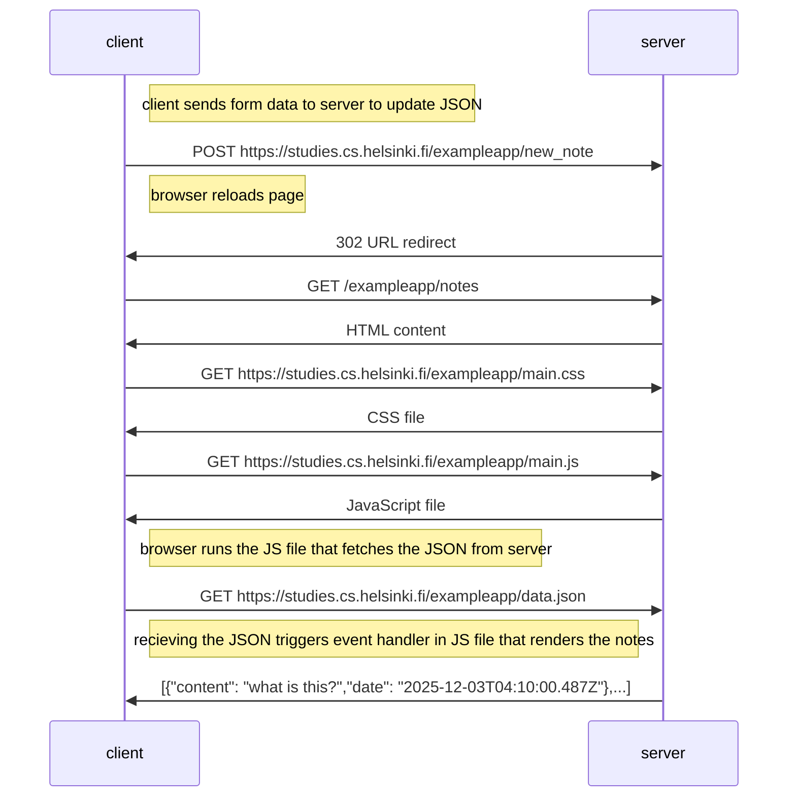

```mermaid
sequenceDiagram
    %% client clicks submit which triggers a POST request to the server

    Note right of client: client sends form data to server to update JSON

    client ->> server: POST https://studies.cs.helsinki.fi/exampleapp/new_note
    
    %% the server responds with 302 status code which causes a URL redirect and causes the browser to make a GET request to the location specified in the headers location

    Note right of client: browser reloads page

    server ->> client: 302 URL redirect
    client ->> server: GET /exampleapp/notes
    server ->> client: HTML content

    %% GET request are made to the remaining main.js, main.css and data.json files in the HTML

    client ->> server: GET https://studies.cs.helsinki.fi/exampleapp/main.css
    server ->> client: CSS file
    client ->> server: GET https://studies.cs.helsinki.fi/exampleapp/main.js

    server ->> client: JavaScript file

    Note right of client: browser runs the JS file that fetches the JSON from server

    client ->> server: GET https://studies.cs.helsinki.fi/exampleapp/data.json

    Note right of client: recieving the JSON triggers event handler in JS file that renders the notes

    server ->> client: [{"content": "what is this?","date": "2025-12-03T04:10:00.487Z"},...]

    %% the fetching of the JSON file triggers an event handler within the JavaScript file which renders the notes to the page using DOM API

```