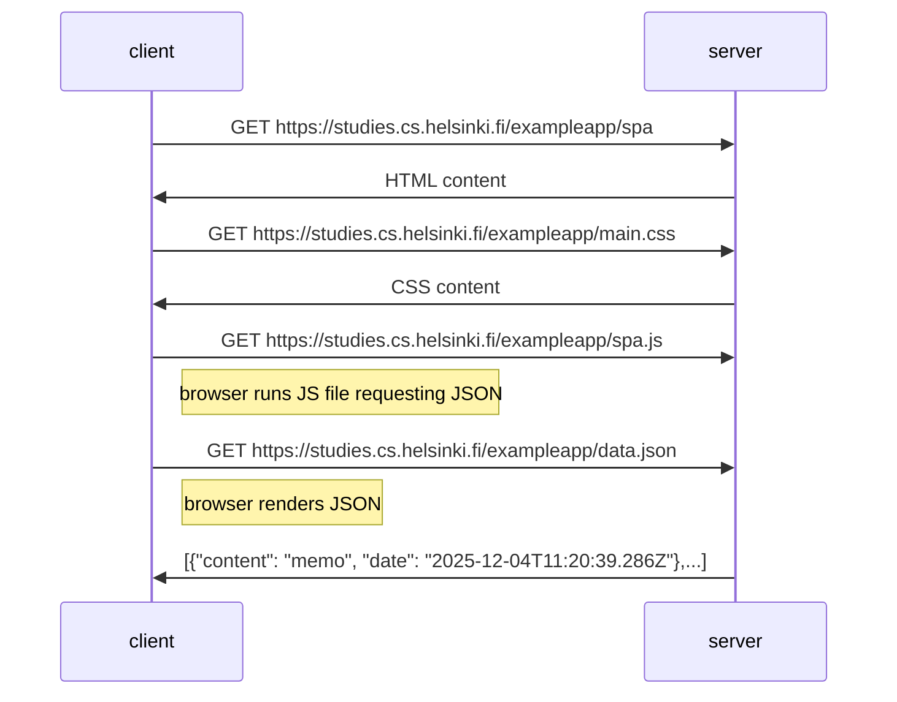

```mermaid
sequenceDiagram
    client ->> server: GET https://studies.cs.helsinki.fi/exampleapp/spa
    server ->> client: HTML content
    client ->> server: GET https://studies.cs.helsinki.fi/exampleapp/main.css
    server ->> client: CSS content
    client ->> server: GET https://studies.cs.helsinki.fi/exampleapp/spa.js
    Note right of client: browser runs JS file requesting JSON
    client ->> server: GET https://studies.cs.helsinki.fi/exampleapp/data.json
    Note right of client: browser renders JSON
    server ->> client: [{"content": "memo", "date": "2025-12-04T11:20:39.286Z"},...]
```