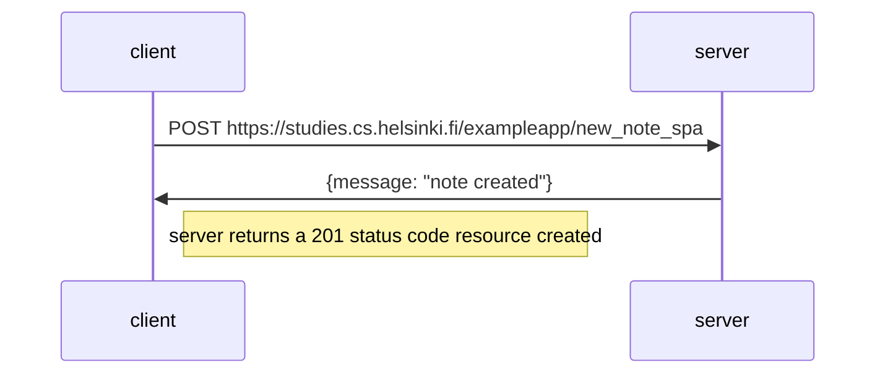

```mermaid
sequenceDiagram
    client ->> server: POST https://studies.cs.helsinki.fi/exampleapp/new_note_spa
    server ->> client: {message: "note created"}
    Note right of client: server returns a 201 status code resource created
```